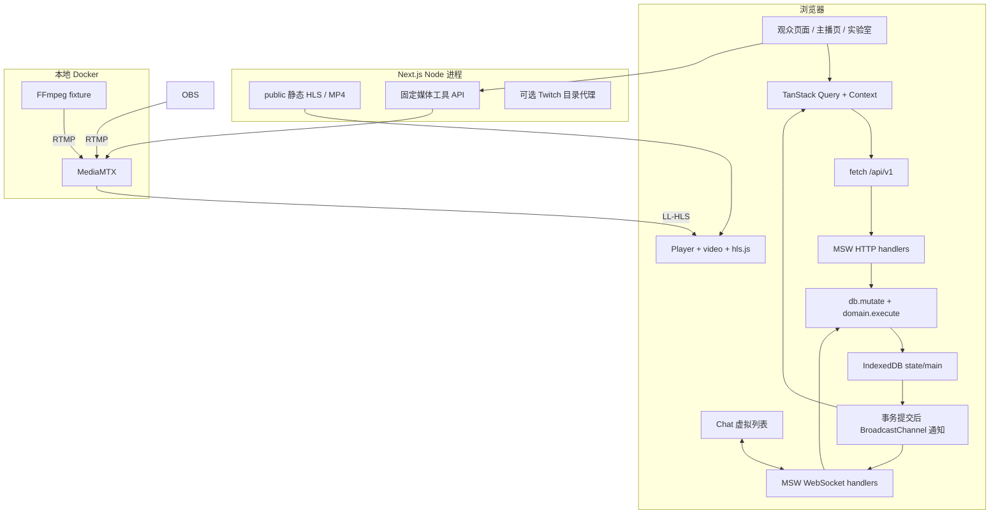
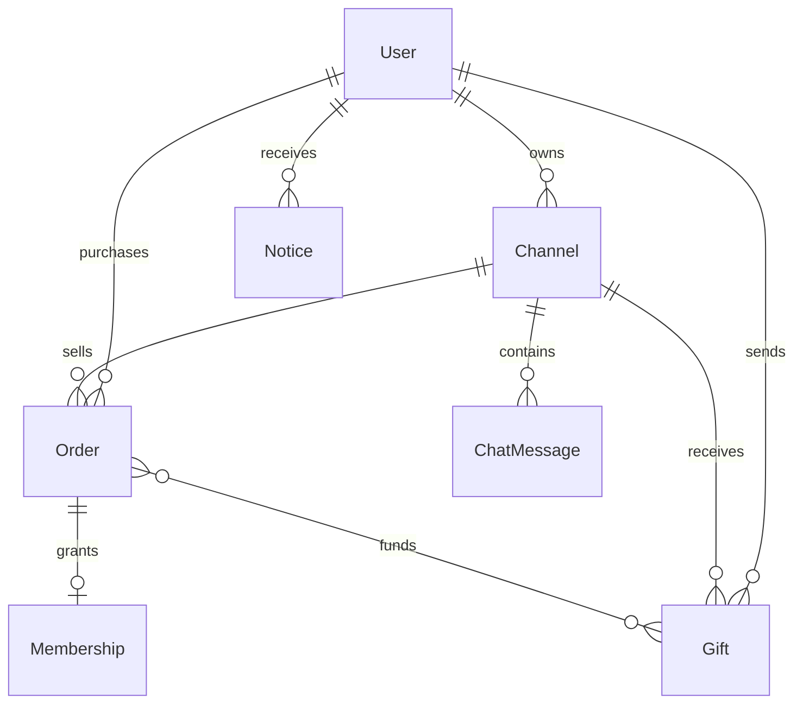
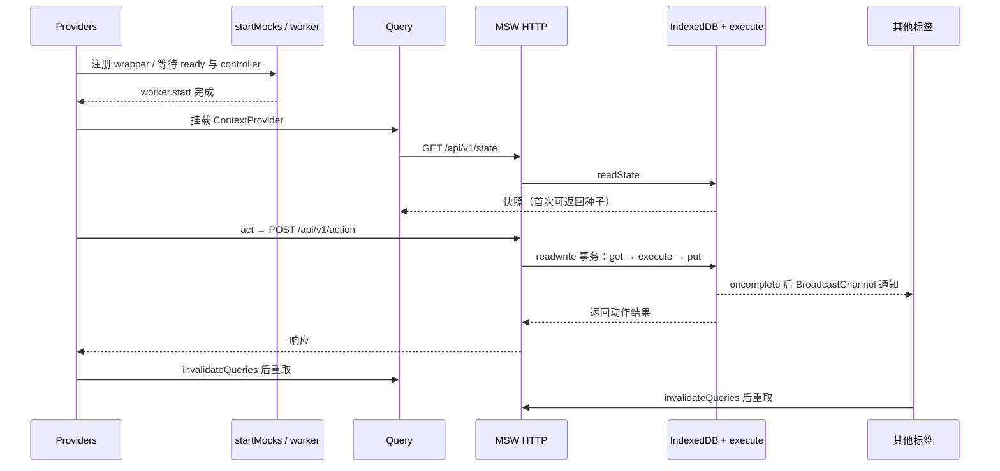
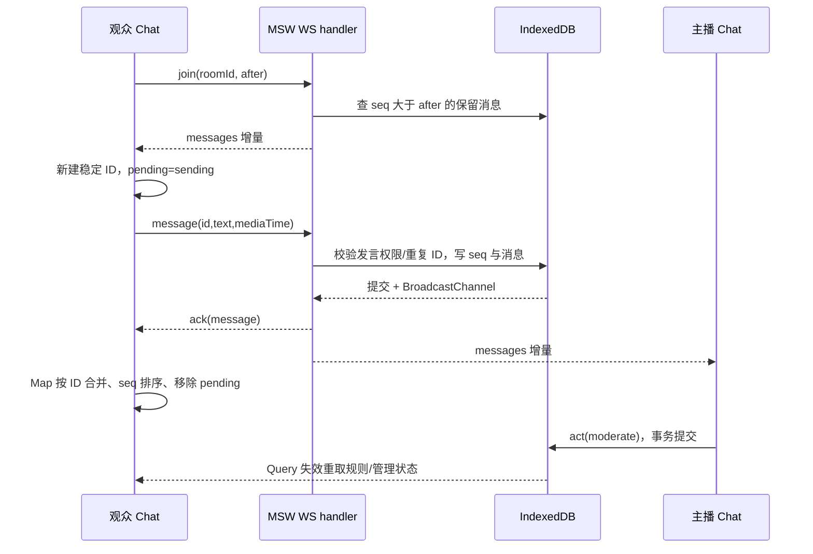
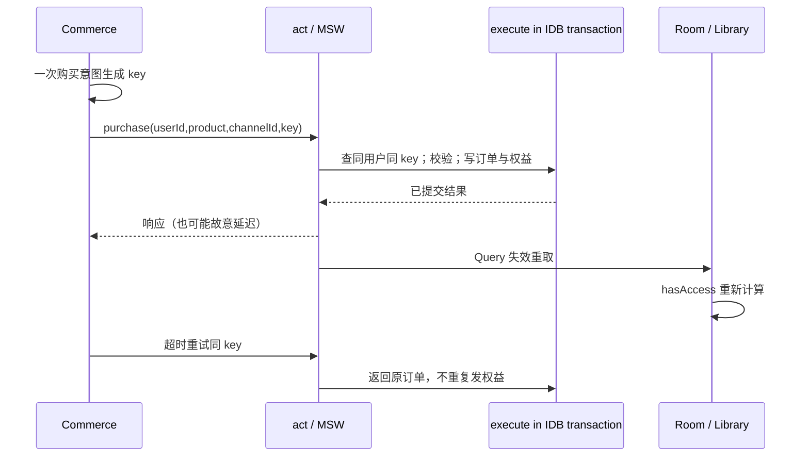
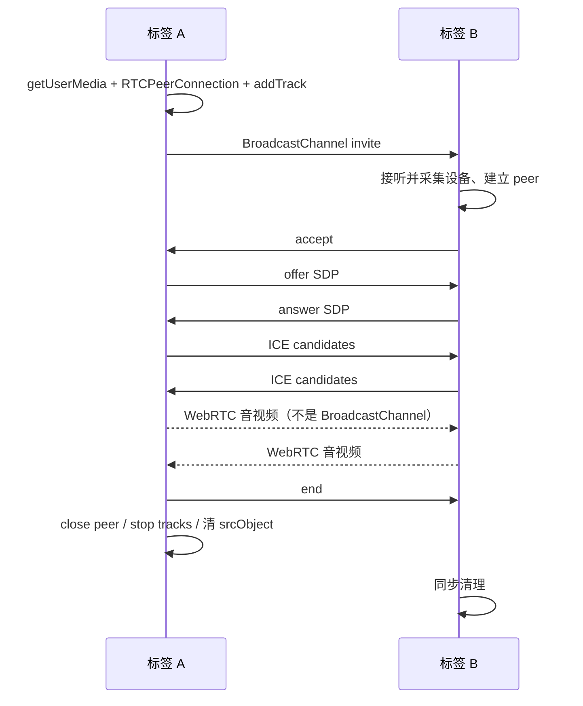

# StreamLab 架构、技术栈与完整实现链路

这份文档描述当前仓库的实际实现。先读本篇建立结构，再按 [JD 学习指南](JD-STUDY.md) 做实验，最后使用 [面试脚本与追问](INTERVIEW.md) 练习表达。接口字段见 [API](API.md)，实测数据见 [验证报告](VERIFICATION.md)。

## 1. 项目是什么，代码运行在哪里

StreamLab 是一个面向直播前端岗位的本地产品实训：观众发现内容、观看和互动，主播管理自己的场次，实验室复现媒体与业务异常。商业交互有完整状态变化，但认证、支付、会员、IM 服务均在浏览器模拟。

**三个运行环境必须分清：**

- 浏览器：React 页面、MSW 业务处理、IndexedDB、聊天客户端、HLS 播放控制、Canvas 弹幕、WebRTC。
- Next.js Node 进程：页面外壳和静态资源、固定用途的媒体状态/录制/故障路由、可选 Twitch 目录代理。
- Docker：MediaMTX 接收、转封装、分发和录制媒体；可选 FFmpeg fixture 产生实际 RTMP 输入。

没有独立业务后端，也没有云 CDN。Next.js 中存在工具 API，不代表登录和订单已经有服务端实现。



图中的 Query 与 Context 分工不同：Query 管请求结果和失效重取，Context 把身份、语言、弹窗、toast 和动作方法传给组件。它们都不是最终持久化来源，业务来源是 IndexedDB。

## 2. 使用了哪些技术，为什么放在这里

下面是仓库依赖主版本，不是“最新版本推荐”；精确安装版本由 [pnpm-lock.yaml](../pnpm-lock.yaml) 决定。

| 技术 | 本项目职责与源码入口 | 学习重点 / 当前边界 |
| --- | --- | --- |
| Next.js 16 App Router | [page.tsx](../src/app/[[...path]]/page.tsx)、[layout.tsx](../src/app/layout.tsx)、工具 route.ts | 路由、客户端/服务端边界、生产构建；业务页主要在客户端取数 |
| React 19 + TypeScript 7 | [components](../src/components)、[types.ts](../src/lib/types.ts) | state/ref/effect、闭包、卸载清理；TS 不能替代运行时校验 |
| Tailwind CSS 4 | 组件 utilities、[globals.css](../src/app/globals.css)、[postcss.config.mjs](../postcss.config.mjs) | 响应式、焦点、减少动态效果；没有另外一套 CSS-in-JS 系统 |
| Radix Dialog | [primitives.tsx](../src/components/ui/primitives.tsx) | Portal、焦点约束、Escape、可访问名称；组件是自建，没有整套引入 shadcn/ui |
| clsx + tailwind-merge + lucide-react | `cn()`、公共 Button 和图标 | 合并条件类、处理 Tailwind 冲突、统一图标 |
| TanStack Query 5 | [providers.tsx](../src/components/providers.tsx) | `queryKey: ['state']`、1 秒 staleTime、失效重取；当前是整份快照查询 |
| TanStack React Virtual 3 | [chat.tsx](../src/components/chat.tsx) | 只渲染可见消息和 overscan；虚拟列表不等于数据自动有界 |
| React Hook Form + resolver + Zod 4 | [auth.tsx](../src/components/auth.tsx)、[domain.ts](../src/lib/domain.ts) | 登录表单校验、动作边界校验；主播设置使用原生 FormData，并非所有表单都使用 RHF |
| next-intl 4 | [providers.tsx](../src/components/providers.tsx)、`Shell` 导航 | 导航使用消息字典；其他页面主要用 `t(中文, English)`，未集中管理所有文案 |
| hls.js 1 + HTMLVideoElement | [player.tsx](../src/components/player.tsx) | 清单/分片、MSE、ABR、错误恢复；没有 fork 或改写 hls.js 内核 |
| MSW 2 | [browser.ts](../src/mocks/browser.ts)、[worker wrapper](../public/streamlab-worker.js) | HTTP/WS 模拟、故障注入；`/api/v1` 请求要在受控浏览器中运行 |
| IndexedDB | [db.ts](../src/lib/db.ts) | 原生 readwrite 事务保证快照原子修改，无 Dexie/ORM |
| BroadcastChannel / sessionStorage / localStorage | `db.ts`、`providers.tsx`、`rtc-lab.tsx` | 跨标签通知、信令、分标签身份、共享偏好；都受 origin 限制 |
| Canvas 2D + requestAnimationFrame | `player.tsx → Danmaku` | 媒体时间调度、轨道间距、有界绘制，不逐帧更新 React |
| WebRTC 浏览器 API | [rtc-lab.tsx](../src/components/rtc-lab.tsx)、[studio.tsx](../src/components/studio.tsx) | 设备采集、SDP、ICE、轨道、getStats；当前只验证本地链路 |
| MediaMTX 1.21.1 + Docker Compose | [media](../media) | RTMP → LL-HLS、WHIP/WHEP、fMP4 录制，不自动产生多码率转码 |
| FFmpeg | [generate-media.mjs](../scripts/generate-media.mjs)、Compose fixture | 编码、缩放、多档 HLS、推流；与播放器解码职责不同 |
| Vitest 5 + fake-indexeddb | [domain.test.ts](../tests/domain.test.ts)、[persistence.test.ts](../tests/persistence.test.ts) | 纯规则、并发扣余额、回滚、退款归属，使用现有行为测试 |
| Playwright | [tests/e2e](../tests/e2e)、[measure-playback.mjs](../scripts/measure-playback.mjs) | 三引擎交互、假设备真实传输、生命周期和压力实验 |
| pnpm 11 + Biome 2 + Husky + lint-staged | [package.json](../package.json)、[biome.json](../biome.json)、[pre-commit](../.husky/pre-commit) | 锁定依赖、格式/lint、类型检查、测试；hook 不包含生产构建或完整 E2E |

未使用 Redux/Zustand、Socket.IO、自研播放器 SDK、数据库服务、真实支付 SDK。项目虽然有 `pnpm-workspace.yaml`，实际是一个应用，该文件主要用于依赖构建许可，并非多包 monorepo。

## 3. 目录与页面入口

```text
streamlab/
├── src/app/
│   ├── layout.tsx                 HTML 外壳、metadata、全局样式
│   ├── [[...path]]/page.tsx       统一页面入口，Suspense 包裹 StreamApp
│   ├── api/media/                真实媒体工具代理与分片故障
│   └── api/twitch/streams/       可选凭据代理（首页未接该目录源）
├── src/components/
│   ├── app.tsx                   Providers → Shell；导航及页面分派
│   ├── providers.tsx             MSW 启动、Query、身份、语言、act
│   ├── home.tsx                  Home / ChannelPage / ChannelCard
│   ├── room.tsx                  直播间组合层与试看、来源选择
│   ├── player.tsx                Player / PlaybackMetrics / Danmaku
│   ├── chat.tsx                  消息状态、连接管理、虚拟列表、房管动作
│   ├── commerce.tsx              会员/票/充值/礼物弹窗
│   ├── auth.tsx / library.tsx    模拟账号与个人业务记录
│   ├── studio.tsx                主播设置、设备、信号、管理和录制入口
│   ├── rtc-lab.tsx                双标签 P2P + MediaMTX WebRTC
│   ├── lab.tsx                    指标、故障、时钟、压测、重置
│   └── ui/primitives.tsx         Button / Modal / Avatar / Empty / Badge
├── src/lib/                      类型、种子、规则、持久化、请求边界
├── src/mocks/browser.ts          模拟 HTTP/WS 协议
├── public/
│   ├── covers/                   本地封面，来源见 ASSETS.md
│   ├── media/                    MP4、主/子 m3u8、TS 分片、VTT 字幕
│   ├── mockServiceWorker.js      MSW 生成文件，不手工改
│   └── streamlab-worker.js       自有 wrapper，主动接管新标签
├── media/                        Docker 配置；recordings 为被忽略的运行数据
├── scripts/                      素材生成、媒体检查、播放实验
├── tests/                        规则/持久化单测与 E2E
├── docs/                         架构、接口、JD 学习、面试及实测记录
└── output-tdd/playwright/         被 Git 忽略的截图、trace、实验原始输出
```

| URL | 实际组件 | 入口后主要动作 |
| --- | --- | --- |
| `/`、`/following` | `Home` | 从种子频道按 URL 条件筛选；顺序沿用种子顺序 |
| `/channel/:id` | `ChannelPage` | 简介、频道内容、日程、会员入口 |
| `/live/:id` | `Room` | 组合 Player、Chat、Commerce、RtcLab |
| `/library?tab=...` | `Library` | 当前身份的关注、订单、会员、记录与设置 |
| `/studio` | `Studio` | 根据当前用户 ownerId 找到频道，默认 MEI 主播可用 |
| `/lab`、`/lab#rtc` | `Lab` | 调试、故障与音视频实训 |

`Shell` 使用 pathname 分派，`Room key={pathname}` 使换房触发独立卸载/挂载。当前不是“每个 URL 都有独立 page.tsx/Server Component”。业务数据依赖浏览器本地库，首次服务端 HTML 只包含初始化外壳；若做生产内容 SEO，再按公开目录/登录业务划分服务端和客户端数据获取。

## 4. 状态模型与存储归属

源码：[types.ts](../src/lib/types.ts)、[seed.ts](../src/lib/seed.ts)、[db.ts](../src/lib/db.ts)。



这张图表示对象间业务关系，不是 SQL 表。IndexedDB 实际只有一个 `state` object store，`main` 键保存 `State` 快照：

- `Channel` 同时包含频道信息、当前 `sessionId/status/startedAt/endedAt`、发言规则和连麦申请，没有独立场次表。
- `Order` 的 ticket 绑定频道及场次；`Membership` 绑定频道和来源订单；`Gift.funding` 保存充值来源分配。
- `seq` 是整个模拟库递增序号，消息另外带 roomId；不能把不同房间的序号间隙都解释成丢消息。
- 点播来源放在 `Channel.source`，没有独立 Video 表。真实录制由媒体接口列出，没有持久化到业务场次目录。
- 个人历史上限 100 条；消息全局最多 4,000 条。订单/礼物/通知未做无限增长治理，长期运行需归档或重置。

存储职责：

```text
sessionStorage streamlab-user        当前标签身份（新窗口可能继承 opener 初始值，随后独立切换）
localStorage streamlab-locale        同 origin 的语言偏好
localStorage streamlab-playback      最近 30 个播放会话，每会话最多 200 个事件
IndexedDB streamlab-demo/state/main  共享业务快照
React state                          弹窗、输入、tab、显示状态
React ref                            HLS、video、peer、stream、游标、timer、回调
```

输入 Action 当前是 `Record<string, unknown> & {type:string}`，不是强类型 discriminated union。Zod/分支检查兜住当前消费字段；生产接口还需要完整 schema、身份校验和不认识字段的处理策略。

## 5. 应用启动与一次业务写入



关键点：`request.onsuccess` 不等于事务提交成功；广播放在 `tx.oncomplete`。`execute` 会原地修改快照，不是 immutable reducer；如果校验失败，`mutate` 负责 abort，持久化状态不接受半截更新。事务内部不等待网络调用。

`startMocks` 缓存 Promise，避免 React Strict Mode 重复启动。自有 worker wrapper 使用 `clients.claim()` 接管新标签，等待 controller 后再挂载业务组件。[MDN：clients.claim](https://developer.mozilla.org/en-US/docs/Web/API/Clients/claim)。

## 6. 发现、登录、预约、通知链路

1. `Home` 从 URL 读取 `q/category/status/language`，筛选名称、标题与标签；筛选变化通过 router.push 写回 URL。
2. `Shell` 把 URL 中的 q 同步到搜索输入，浏览器返回/刷新后条件一致。推荐列表保持种子顺序，轮播取固定频道索引。
3. 未登录执行关注/收藏/预约，`act` 保留一次 pendingIntent 并打开 AuthDialog；登录后重放该动作。购买不自动重放。
4. `AuthDialog` 用 RHF/Zod 校验，固定验证码 `246810`；注册写本地用户，登录只设置本标签 userId。没有密码数据库、JWT、OAuth 登录或 cookie session。
5. `reserve` 更新用户预约，并写站内通知。主播手动 `start` 后，为允许通知的预约用户追加开播通知；不是系统 Push/邮件服务，也没有到点自动开播调度器。
6. `Room` 进入时记录观看历史，`Library` 根据当前用户过滤展示。

## 7. HLS 点播、真实开播与录制

### 本地三档点播

```text
generate-media.mjs
  图片 + 合成正弦音 → 60 秒 H.264/AAC MP4
  → FFmpeg 同时编码 720p / 480p / 360p
  → master.m3u8 → 对应 v*/index.m3u8 → segment_*.ts
  → hls.js 解析/加载/转封装 → MSE SourceBuffer → 浏览器解码渲染 → video
```

`.ts` 在 public/media 中表示 MPEG-TS 分片，不是 TypeScript 文件，所以 tsconfig 与 Biome 排除媒体目录。转封装改变容器，转码改变编码数据，浏览器播放阶段最终仍由浏览器的媒体实现解码。[hls.js 官方说明](https://github.com/video-dev/hls.js/blob/master/README.md)、[MDN MSE](https://developer.mozilla.org/en-US/docs/Web/API/Media_Source_Extensions_API)。

实际 Player 分支：iframe 来源直接嵌入；普通 file 用 video.src；HLS 优先 `Hls.isSupported()`，否则尝试 video 原生 HLS。手动清晰度来自真实 manifest levels，ABR 由 hls.js 实现；没有在 React 中另写码率估算器。

### 本地实时链路

```text
OBS / FFmpeg fixture：H.264 + AAC
  → RTMP 127.0.0.1:1935/live
  → MediaMTX live 路径
  → LL-HLS localhost:8888/live/index.m3u8
  → Player 真实解码
```

前端“开始场次”只是业务状态修改；OBS/fixture 才产生媒体输入。Studio 每 5 秒通过固定 Node 代理查询 MediaMTX ready，分别显示业务状态和实际信号。

MediaMTX 本版没有配置实时多码率转码，直播默认单档；ABR 用 FFmpeg 预生成的多档点播验证。LL-HLS 需要源端配合，不能只凭 `lowLatencyMode:true` 声称有低延迟保障；也没有测量玻璃到玻璃延迟。[MediaMTX 发布说明](https://mediamtx.org/docs/features/publish)。

### 录制回放

MediaMTX 将 live 录制为磁盘 fMP4，`recordSegmentDuration:1m` 是录制文件分段，与 HLS 分片时长不是同一参数。`/api/media/recordings` 获取列表，`/api/media/recording` 固定代理 live 路径 MP4，video 通过 file 分支播放。

当前限制：回放代理单次最多 3600 秒，未实现完整 Range 转发；列表还未按业务 sessionId 精确关联。只有 MEI 观众房间有这一实际录制入口。扩展多主播/长场次时需要独立媒体路径和回放目录。

## 8. 播放器生命周期与指标

按 [player.tsx](../src/components/player.tsx) 的一个主 effect 阅读：

```text
创建实例、session ID、起点时间
  → 绑定 video 事件 / 帧回调
  → 创建 hls.js 或设置原生 src
  → manifest parsed → 尝试播放 → 首帧 / waiting / playing
  → fatal 错误分类恢复或显示重试
  → 切房、换源、手动重载、卸载：cleanup
```

- ref 持有 video、HLS、metrics 和最新回调；React state 持有按钮状态、进度等展示数据。
- 首帧等待 `requestVideoFrameCallback`；不支持时使用 playing 近似并加日志。计时包含自动播放被拒后用户等待，未另拆交互等待时间。
- waiting 在首帧之后、非 paused、非 seeking 且未开始 stall 时才增加次数；playing/pause/seeking/ended/cleanup 结算区间。当前没有单独绑定 stalled 事件。
- 网络 fatal：初始 manifest 无 level 时重新 loadSource，有 level 的后续错误使用 startLoad；媒体 fatal 用 recoverMediaError。应用层自动恢复两次，延迟 1/2 秒，随后手动重试。库自己的请求重试另算。
- 每秒读取当前所在 buffered 区间末端与 currentTime 的差；每秒汇总指标，timeupdate 更新控制条；Canvas rAF 不触发 React 每帧更新。
- cleanup 阻止旧回调更新，保存会话，清 interval/重试 timer/帧回调/监听，destroy HLS，pause、remove src、load video，减少实例计数。

当前指标的确切含义：

| 字段 | 当前采集来源 | 不要误解为 |
| --- | --- | --- |
| startupMs | effect 起点到首帧回调 | 从用户点击/页面导航开始的全链路耗时 |
| stalls / stallMs | 受状态过滤的 waiting 区间 | 已实现整个平台的卡顿率、p95 分位数 |
| buffer | buffered 区间减 currentTime，秒 | 网络带宽或直播延迟 |
| dropped | getVideoPlaybackQuality；不可用时回落 0 | 所有浏览器都已测得零掉帧 |
| level | LEVEL_SWITCHED 对应高度 | 实时测得的下载吞吐率 |
| events[].time | performance.now 单调时钟 | Unix 时间戳或用户当地时间 |
| WebRTC packets/lost/jitter | inbound-rtp 视频统计 | 已实现端到端延迟和区间丢包率 |

第三方 iframe 指标显示 N/A，不能跨域读取其底层缓冲/清晰度。当前是本地 QoE 日志与导出，没有接入生产监控上报、全局异常采集或告警平台。

## 9. IM、弹幕与主播管理



连接每 5 秒心跳，15 秒未收到任何消息则关闭，ACK 超过 8 秒在下一次轮询时标记失败。自动重连间隔 0.5/1/2/4/8 秒，之后手动重连；重试使用原消息 ID。

新消息由 WS/补拉进入列表，Query 刷新只修补已经收到消息的管理状态，避免断线时通过快照刷新提前看到新消息。慢速模式、会员/关注者限制、禁言在 `domain.execute` 中统一判断。当前演示房管是全局角色。

**四层容量约束：**持久化消息全局 4000 → 客户端 merge 窗口 500 → 默认可见集合 100（可展开窗口）→ 虚拟 DOM 仅可见行与 overscan。当前“加载更早”不是 HTTP 历史分页；虽然存在 messages HTTP 接口，Chat 实际用 WS join 补拉。

`after` 是已见最大 seq，本模拟传输按完整增量批次提供数据；没有最大连续序号、范围缺口追补、过期游标协商或乱序包完整缓存。可讲重复 ACK 和断线补拉，不能据此承诺任意丢包下消息绝不遗漏。

弹幕接收 Chat 窗口，经 Room 传给 Canvas。发送时记录 `video.currentTime`；绘制以媒体时间计算 x，暂停时不移动，时间跳变时清旧轨迹。轨道入口按文本宽度+间距释放，同速避免追尾。最多扫描最近 200 条、绘制 40 条；高密度时允许丢弃展示。没有独立的全量回放弹幕时间索引，缺少 mediaTime 的消息回落到 0。

## 10. 商业链路与一致性



- 禁用按钮改善体验；幂等键防重，IDB 同一 readwrite 事务防并发超支，三者职责不同。
- 用户+key 去重。当前同 key 未比较载荷指纹；关闭再打开弹窗会生成新意图，未完成订单意图未持久化到刷新后。
- 月会员在本版按固定 30 天计算；取消续费保留 until，模拟时钟推进后自然无权。自动续费开启者到期时模拟失败，不发生真实周期扣款。
- 单场 ticket 对应 sessionId，预约转直播保持场次 ID；下一场重开才换 ID，避免上一场票误用。
- 退款成功后订单变 refunded、对应会员记录被删除；ticket 通过 paid 检查失效。重复退款返回现有状态。
- 礼物扣余额、交易来源分配和礼物聊天消息一起提交。充值已使用时退款进入 pending，不能因为用户后来再次充值就退款旧订单。
- `Room` 的 15 秒试看锁只暂停前端播放器，媒体 URL 仍可获得，不构成真实付费授权。第三方嵌入不加本项目收费门槛。

## 11. WebRTC 两种链路

### 同机双标签连麦



SDP 描述协商参数，ICE candidate 表示候选连接地址；先收到 candidate 时排队，设置远端 SDP 后再 addIceCandidate。`generation` 防止用户挂断后设备授权才返回：过期结果立即停止轨道。信令不等于音视频通道。[MDN 信令与视频通话](https://developer.mozilla.org/en-US/docs/Web/API/WebRTC_API/Signaling_and_video_calling)。

`iceServers:[]` 只用于本机实训，无公网 STUN/TURN。业务“接受连麦申请”与实际 RTC 邀请分开：双方打开同 roomId 的连麦组件后才进行媒体协商，也没有把双方画面混入主直播。

### 浏览器经 MediaMTX 发布/订阅

`MediaRtc.connect(true)` 采集并 addTrack，false 创建 recvonly transceiver；生成 offer，等待 ICE 完成或最多 3 秒，通过 HTTP POST application/sdp 发送到 `/rtc/whip` 或 `/rtc/whep`，读取 answer 设置远端描述。

响应 Location 保存会话 URL，停止时 DELETE；AbortController 和 peer 身份比较防止旧请求错误关闭新连接。没有实现完整 PATCH trickle ICE/ICE restart。发布视频优先 H.264，浏览器音频协商与 OBS AAC 不可混为一谈，当前使用独立 rtc 路径验证音视频兼容性。[MediaMTX WebRTC 编码与连接说明](https://mediamtx.org/docs/features/webrtc-specific-features)。

## 12. 测试、故障与扩展边界

业务场景 normal/slow/error/expired/timeout/disconnect/duplicate/reorder 位于 MSW；媒体 slow/fail/bandwidth 位于 Node 固定分片路由。修改业务 slow 不会让 video 的 TS 分片变慢。

媒体限速每请求约 0.52Mbps（16KiB/250ms），并发分片不共享总带宽。清单重写仅针对当前简单相对 URI 素材，未覆盖加密 KEY、MAP 等标签内 URI。它是可重复实验工具，不是完整网络仿真器。

工程命令、测试数量和历史结果统一以 [VERIFICATION.md](VERIFICATION.md) 为准。读测试时按规则测试 → 事务测试 → 业务 E2E → 生命周期/压力 → 音视频实验的顺序，不把 Chromium 假设备或 WebKit 检查冒充物理设备/Safari 验收。

扩展生产系统时的替换点：

- 保留前端动作、播放和展示逻辑，把 MSW 换为真实鉴权/API/IM；服务端成为价格、订单、权益与消息序号的权威来源。
- 拆快照为按频道/用户/订单的查询，完善历史分页、消息缺口恢复与窗口淘汰；按性能测量决定是否拆 Context。
- 媒体增加转码梯度、CDN、签名 URL、录制场次映射；公网连麦增加真实信令和 TURN/SFU。
- 本地播放日志扩展为有采样、脱敏、批量上报、去重与重试的 QoE/异常采集；这部分当前尚未实现。

## 13. UI 参考

独立品牌，借鉴 [Twitch](https://www.twitch.tv/directory) 的导航和视频聊天布局、[YouTube Live](https://www.youtube.com/live) 的内容组织、[Uscreen](https://www.uscreen.tv/live-streaming-platform/) 的付费入口。素材来源见 [ASSETS.md](ASSETS.md)。官方嵌入能力边界分别查 [Twitch 文档](https://dev.twitch.tv/docs/embed/video-and-clips/) 与 [YouTube 文档](https://developers.google.com/youtube/iframe_api_reference)。
